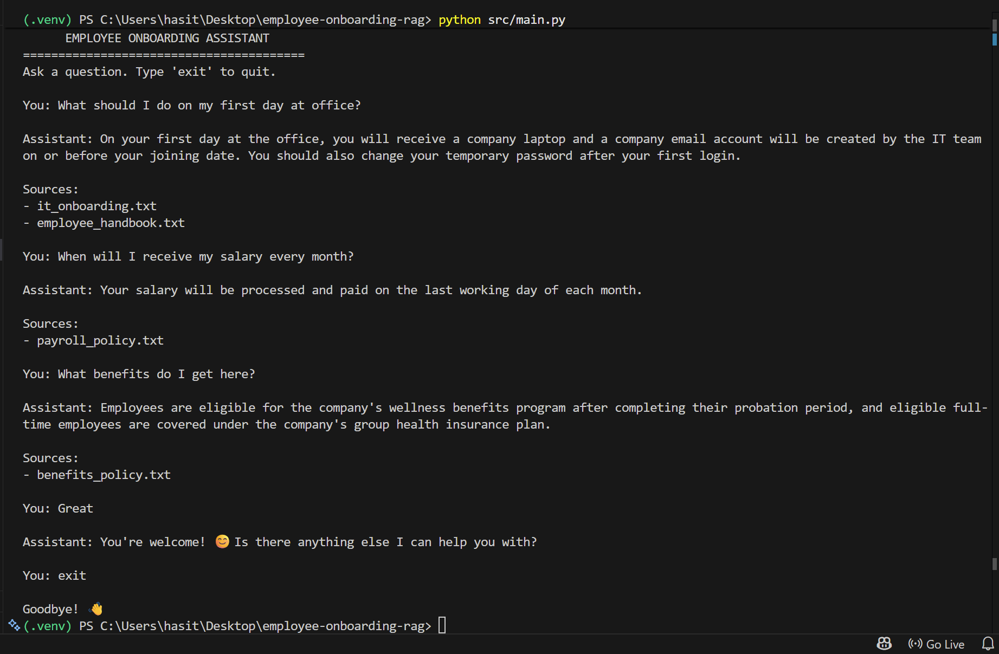

# Employee Onboarding RAG Assistant

## Version 1 — Basic RAG Prototype

A Retrieval-Augmented Generation (RAG) based employee onboarding assistant that answers questions using company policy documents.

### Tech Stack

- Python 3.11
- Ollama
- Llama 3.2 3B — LLM
- nomic-embed-text — Embeddings
- ChromaDB — Vector Database
- LangChain Text Splitters

### Current Features

- Load employee policy documents
- Split documents into chunks
- Generate embeddings
- Store embeddings in ChromaDB
- Rewrite user queries for better retrieval
- Retrieve relevant document chunks
- Generate answers using Llama 3.2
- Display sources used for the answer
- Handle basic greetings and acknowledgements
- Avoid answering when information is unavailable in the knowledge base
- Interactive CLI-based chat

### Knowledge Base

- Leave Policy
- IT Onboarding Policy
- Work From Home Policy
- Benefits Policy
- Payroll Policy
- Employee Handbook

### RAG Flow

```text
Documents
    ↓
Chunking
    ↓
Embeddings
    ↓
ChromaDB
    ↓
User Query
    ↓
Query Rewriting
    ↓
Retrieval
    ↓
LLM Generation
    ↓
Answer + Sources
```

### Output

