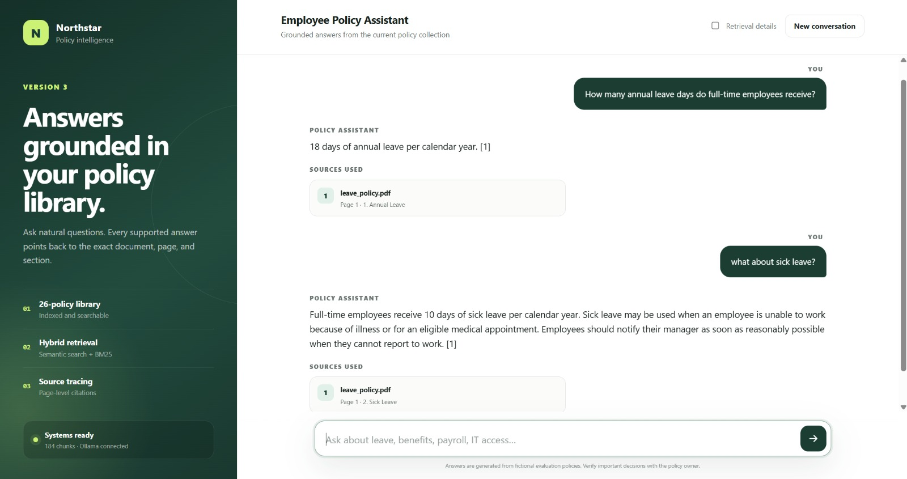
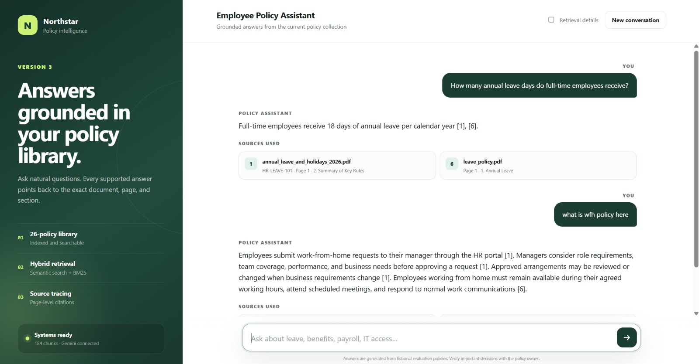
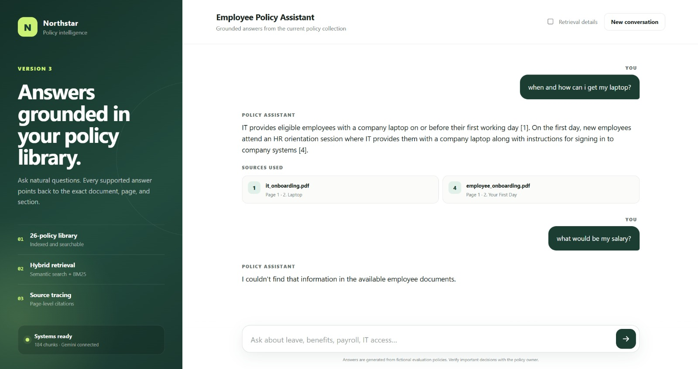
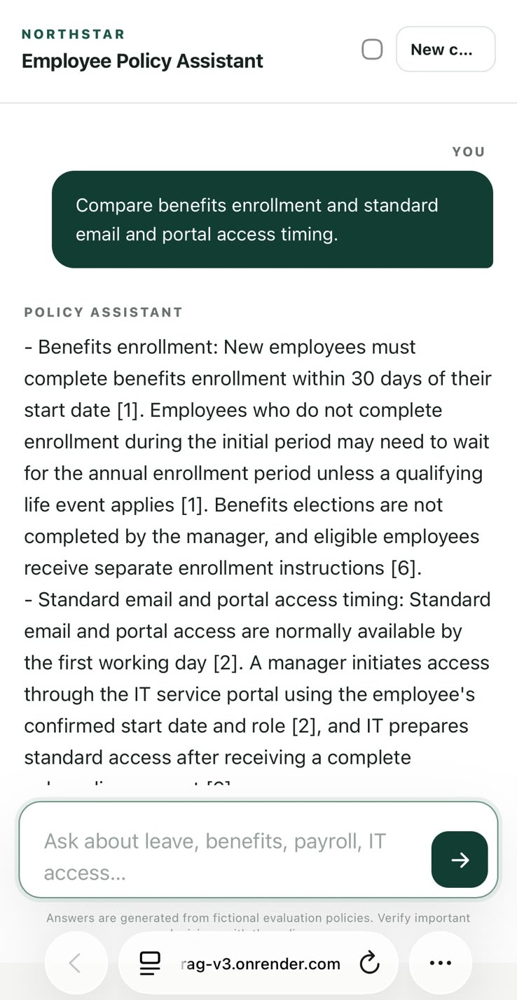

# Employee Onboarding RAG Assistant

A three-stage Retrieval-Augmented Generation project that answers employee-policy questions with grounded sources. It evolves from a small text-based CLI into a conversational PDF RAG application with hybrid retrieval, evaluation, FastAPI, and a responsive web interface.

**[Click-here for Project's Live Link](https://employee-policy-rag-v3.onrender.com/)**

> The policies are fictional and intended for learning and portfolio demonstration. The free Render service may take a short time to wake up.

## Version Evolution

| Version | Knowledge base | Retrieval | Interface |
| --- | --- | --- | --- |
| **V1** | Six TXT policies | Multi-query semantic search | Ollama CLI |
| **V2** | Page-aware PDFs | Semantic search with lexical relevance checks | Conversational Ollama CLI |
| **V3** | 26 structured PDFs | Semantic + BM25, reciprocal-rank fusion, and diversity selection | CLI, FastAPI, and web app |

```text
Documents → Load and normalize → Chunk → Embed → ChromaDB
                                                     ↓
Answer + cited sources ← Grounded LLM prompt ← Retrieve ← Question
```

## Technology

- Python 3.11, FastAPI, and Uvicorn
- ChromaDB with cosine similarity
- `pypdf` for PDF extraction
- Ollama with `llama3.2:3b` and `nomic-embed-text` for local use
- Gemini with `gemini-3.5-flash-lite` and `gemini-embedding-001` on Render
- Custom BM25 and reciprocal-rank fusion in Version 3

## Run Locally

Create and activate a Python 3.11 environment, install dependencies, and ensure Ollama is running:

```powershell
.venv\Scripts\Activate.ps1
pip install -r requirements.txt
ollama pull llama3.2:3b
ollama pull nomic-embed-text
```

Each version has its own ingestion and application entry points:

```powershell
# Version 1
python src/ingest.py
python src/main.py

# Version 2
python -m src.v2.ingest_v2
python -m src.v2.main_v2

# Version 3 CLI
python -m src.v3.ingest_v3
python -m src.v3.main_v3

# Version 3 web application
python -m src.v3.api_v3
```

Open `http://127.0.0.1:8000` for the web interface or `http://127.0.0.1:8000/docs` for the interactive API documentation.

## Version 1 — Basic Text RAG

Version 1 in `src/` introduces the complete RAG lifecycle using six TXT policies. It creates overlapping 500-character chunks, embeds them with Ollama, stores them in ChromaDB, expands questions into alternate search queries, and generates answers with cited filenames. It also handles greetings and refuses unsupported questions.


## Version 2 — Structured PDF RAG

Version 2 in `src/v2/` reads every PDF in `data/documents/PDF Files/`. It normalizes page text, preserves numbered sections, and splits only long sections at sentence boundaries. Retrieval combines semantic distance with lexical checks and source diversity. Short-term memory rewrites ambiguous follow-ups, while answer validation requires citations and rejects unsupported numbers.

```powershell
python src/v2/test_pdf_reader.py
python src/v2/test_chunk_pdf.py
python src/v2/test_memory_v2.py
```


## Version 3 — Hybrid RAG Application

Version 3 in `src/v3/` is the full application. Its main improvements are:

- Adaptive, section-aware chunking with content-based IDs
- Incremental ingestion that embeds only new or changed chunks
- Independent semantic and BM25 retrieval fused with reciprocal-rank fusion
- Comparison coverage, duplicate reduction, and per-source limits
- Multi-turn query resolution with bounded session memory
- Browser-local conversation history with restorable follow-up context
- Grounded prompting, inline citations, and citation-support checks
- Retrieval evaluation for source hit rate and mean reciprocal rank
- FastAPI endpoints and a responsive browser interface

```powershell
python -m src.v3.test_chunking_v3
python -m src.v3.test_retrieval_math_v3
python -m src.v3.evaluate_v3
```


### Web Interface

The web client and API run in one FastAPI process. The interface provides isolated sessions, browser-local conversation history, follow-up memory, source cards, retrieval diagnostics, health information, and a new-conversation action. Greetings and thank-you messages are handled directly without running document retrieval.


## Deployment

[`render.yaml`](render.yaml) defines the free Render web service. During deployment, Render installs dependencies, ingests the PDF collection, and starts Uvicorn. The deployed application uses Gemini for both generation and embeddings:

- `gemini-3.5-flash-lite` for query rewriting and grounded answers
- `gemini-embedding-001` for document and query embeddings
- `employee_policies_v3_gemini` as the deployment collection

Create `GEMINI_API_KEY` as a secret in Render; never commit it or expose it to the browser. The free Gemini tier has request limits. Ingestion retries temporary per-minute limits, while daily quota exhaustion requires waiting for Google’s quota reset.

## Project Structure

```text
data/documents/             TXT policies and shared PDF corpus
src/                        Version 1 pipeline and CLI
src/v2/                     Version 2 PDF pipeline and CLI
src/v3/                     Version 3 RAG, evaluation, API, and web client
output/                     Demonstration screenshots
render.yaml                 Render deployment blueprint
requirements.txt            Python dependencies
```

Local Chroma databases, `.env`, API keys, and local contributor/reference files are excluded from Git.

## Version 3 Sample Outputs

The examples demonstrate grounded policy answers, citations, follow-up questions, unsupported-question handling, comparisons, and mobile layout.








