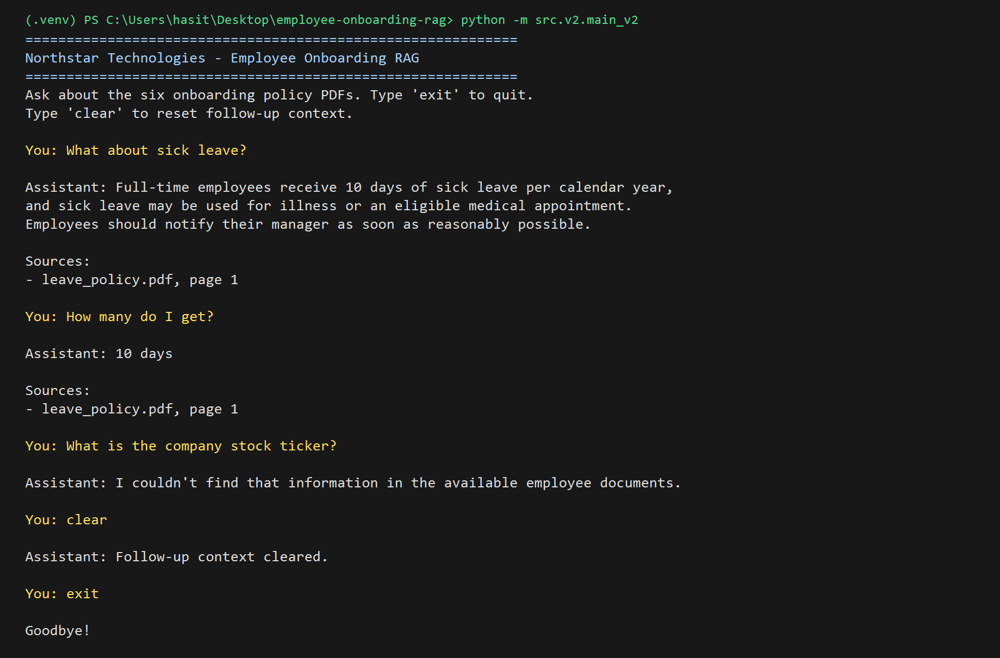
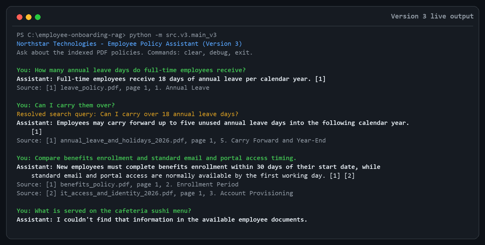
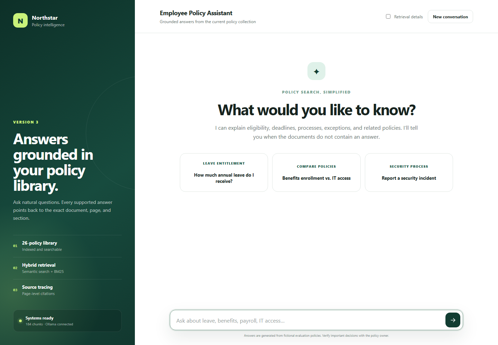

# Employee Onboarding RAG Assistant

## Version 1 — Basic RAG Prototype

A Retrieval-Augmented Generation (RAG) based employee onboarding assistant that answers questions using company policy documents.

### Tech Stack

- Python 3.11
- Ollama
- Llama 3.2 3B — LLM
- nomic-embed-text — Embeddings
- ChromaDB — Vector Database
- LangChain Text Splitters

### Current Features

- Load employee policy documents
- Split documents into chunks
- Generate embeddings
- Store embeddings in ChromaDB
- Rewrite user queries for better retrieval
- Retrieve relevant document chunks
- Generate answers using Llama 3.2
- Display sources used for the answer
- Handle basic greetings and acknowledgements
- Avoid answering when information is unavailable in the knowledge base
- Interactive CLI-based chat

### Knowledge Base

- Leave Policy
- IT Onboarding Policy
- Work From Home Policy
- Benefits Policy
- Payroll Policy
- Employee Handbook

### RAG Flow

```text
Documents
    ↓
Chunking
    ↓
Embeddings
    ↓
ChromaDB
    ↓
User Query
    ↓
Query Rewriting
    ↓
Retrieval
    ↓
LLM Generation
    ↓
Answer + Sources
```

### Output


## Version 2 - PDF RAG Pipeline

Version 2 uses six one-page PDF policies as its knowledge base:

- `benefits_policy.pdf`
- `employee_onboarding.pdf`
- `it_onboarding.pdf`
- `leave_policy.pdf`
- `payroll_policy.pdf`
- `work_from_home_policy.pdf`

The PDF pipeline is implemented in `src/v2/`. `pdf_reader.py` extracts and normalizes page text with `pypdf`; `chunk_pdf.py` splits at policy section headings and only subdivides unusually long sections at sentence boundaries, retaining source, page, and section metadata; `ingest_v2.py` embeds each chunk with Ollama and synchronizes it into the local Chroma collection `employee_policies_v2`; `retrieval_v2.py` embeds a question, applies semantic and lexical relevance checks, and returns focused policy excerpts; `generation_v2.py` asks the Llama model to answer only from those excerpts and parse source citations; `memory_v2.py` rewrites context-dependent follow-ups using a bounded recent-turn window; and `main_v2.py` provides the interactive CLI.

### Running Version 2

From the repository root, activate the Python 3.11 environment and ensure Ollama is running:

```powershell
.venv\Scripts\Activate.ps1
ollama pull llama3.2:3b
ollama pull nomic-embed-text
python -m src.v2.ingest_v2
python -m src.v2.main_v2
```

Configuration is read from `.env` (`PDF_DIRECTORY`, `LLM_MODEL`, `EMBEDDING_MODEL`, `CHROMA_PATH`, `COLLECTION_NAME`, `TOP_K`, `DISTANCE_THRESHOLD`, `MEMORY_TURNS`, `MAX_SECTION_CHARS`, `MIN_SECTION_CHUNKS`, `RETRIEVAL_CANDIDATE_MULTIPLIER`, `MAX_CHUNKS_PER_SOURCE`, `LEXICAL_FALLBACK_DISTANCE`, `LEXICAL_SCORE_WEIGHT`, `RANK_SCORE_MARGIN`, and `MAX_REWRITE_CHARS`). The assistant cites the policy file and page used for an answer and returns `I couldn't find that information in the available employee documents.` when the PDFs do not support the question. Type `clear` during a session to remove follow-up context. Parser, chunking, and memory smoke checks can be run with `python src/v2/test_pdf_reader.py`, `python src/v2/test_chunk_pdf.py`, and `python src/v2/test_memory_v2.py`.

### Version 2 Output

The example shows section-grounded retrieval, a follow-up resolved from session memory, an unsupported-question fallback, and clearing the stored conversation context.



## Version 3 - Hybrid Policy RAG

Version 3 is isolated in `src/v3/` and reads every PDF found in the configured
directory; it does not assume a fixed document count. The current shared corpus
contains the six baseline policies plus 20 fictional, two-page policies with
effective dates, tables, eligibility distinctions, exceptions, and cross-policy
references.

The pipeline removes repeated PDF headers, preserves numbered policy sections,
and adaptively splits only sections that exceed a configurable word ceiling.
Stable content hashes allow incremental ingestion: unchanged chunks keep their
embeddings while changed and deleted content is synchronized. Retrieval combines
cosine-nearest semantic candidates with BM25 keyword candidates using reciprocal
rank fusion, then reduces redundant evidence before grounded generation. Answers
use verified inline citations, while bounded session memory rewrites ambiguous
follow-up questions. A checked-in evaluation set measures source hit rate and
mean reciprocal rank.

```powershell
python -m src.v3.test_chunking_v3
python -m src.v3.test_retrieval_math_v3
python -m src.v3.ingest_v3
python -m src.v3.evaluate_v3
python -m src.v3.main_v3
python -m src.v3.api_v3
```

The final command starts the FastAPI service and responsive chat interface at
`http://127.0.0.1:8000`. Interactive API documentation is available at
`http://127.0.0.1:8000/docs`. The web client provides isolated session memory,
structured source cards, optional retrieval diagnostics, service health, and
conversation reset. Run Version 3 ingestion before starting the web application.

Version 3 settings use the `V3_` prefix, including `V3_PDF_DIRECTORY`,
`V3_CHROMA_PATH`, `V3_COLLECTION_NAME`, `V3_MODEL_PROVIDER`, `V3_LLM_MODEL`,
`V3_EMBEDDING_MODEL`,
`V3_MAX_CHUNK_WORDS`, confidence thresholds, candidate counts, rank-fusion
controls, and memory limits.

### Version 3 Output

The output below demonstrates grounded citations, session-aware follow-up
rewriting, a cross-policy comparison, and rejection of an unsupported question.



### Version 3 Web Interface

The FastAPI application serves the chat frontend and JSON API from the same
process. The interface reads document and chunk counts from the health endpoint
instead of assuming a fixed corpus size.



### Deploying Version 3

`render.yaml` defines a Render web service that installs dependencies, builds
the Chroma index from the repository PDFs, and starts Uvicorn. Version 3 selects
its model backend with `V3_MODEL_PROVIDER`: local development defaults to Ollama
with `llama3.2:3b` and `nomic-embed-text`, while the Render blueprint selects
Gemini with `gemini-2.5-flash` and `gemini-embedding-001`. Add a free-tier
`GEMINI_API_KEY` as a secret in Render. The browser never receives this key.

The document index and query must always use the same provider and embedding
model. Render therefore uses its own Gemini collection name and rebuilds it at
deploy time. Ingestion respects Gemini's free per-minute embedding quota by
waiting for the retry delay returned by Google and resuming the failed batch.
If the daily free quota is exhausted, the API returns a clear quota message
instead of falling back to a paid provider. Never commit API keys.

To deploy without model charges, create a Gemini API key in a Google AI project
that does not have Cloud Billing enabled. In Render, create a Blueprint from this
repository, select the Free instance defined in `render.yaml`, and enter the key
when Render requests `GEMINI_API_KEY`. Free-tier quotas are limited, so this
configuration is intended for learning and portfolio demonstrations.
